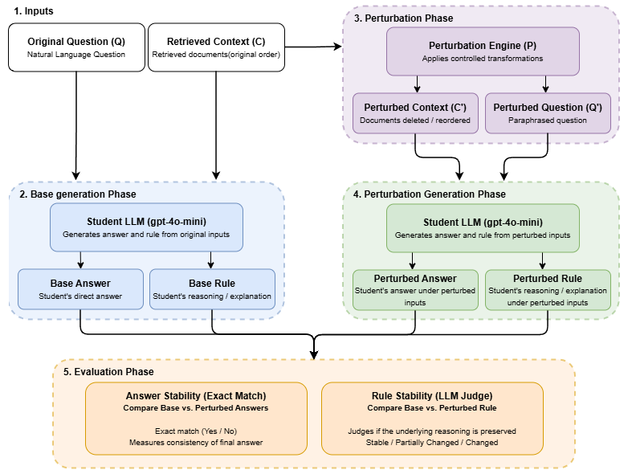
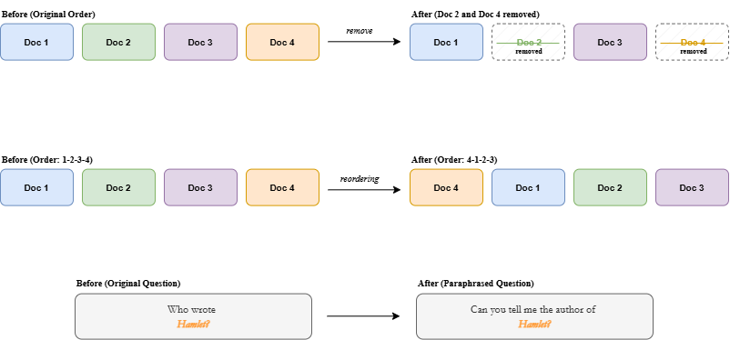
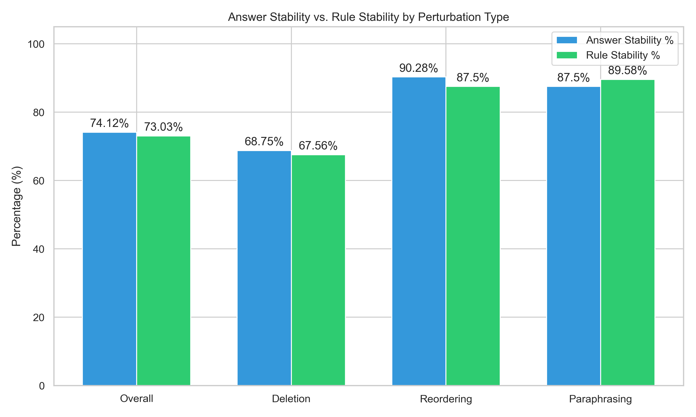
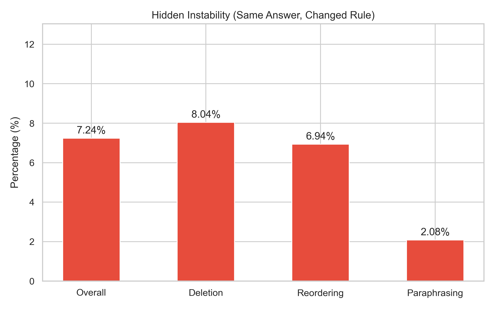

# 🧩 Are Retrieval-Augmented Generation (RAG) Explanations Stable? Evaluating the Robustness of Rule-Based Reasoning under Perturbations

[](https://www.python.org/downloads/)
[](https://github.com/facebookresearch/faiss)
[](https://streamlit.io/)
[](LICENSE)

---

## 📌 Summary

While Retrieval-Augmented Generation (RAG) models have advanced multi-hop question answering by grounding generation in retrieved evidence, the **stability of their internal logical explanations** under input perturbations remains poorly understood. 

This repository provides an end-to-end framework to evaluate whether rule-based explanations generated by RAG systems remain stable when faced with:
1. **Document Deletion** (subset context combinations across top-$k$ retrieved items).
2. **Context Reordering** (permutations of retrieved documents).
3. **Question Paraphrasing** (meaning-preserving semantic variations of the user prompt).

Using **HotpotQA (distractor setting)**, dense vector retrieval (**SentenceTransformers `all-MiniLM-L6-v2`** + **FAISS IndexFlatIP**), LLM generation (**`gpt-4o-mini`**), and strict LLM-as-a-Judge evaluation (**`gpt-4o`**), we evaluate **456 perturbation trials** across 50 multi-hop reasoning baseline questions.

---

## 🏗️ System Architecture & Workflow

<p align="center">
  
</p>

### Perturbation Strategies
<p align="center">
  
</p>

The pipeline operates across 8 sequential stages:
1. **Data Selection (`src/prepare_data.py`)**: Filters multi-hop factual questions from HotpotQA validation split with ground truth supporting facts.
2. **Indexing (`src/build_index.py`)**: Extracts unique passage context and indexes document embeddings into a FAISS vector database using cosine similarity.
3. **Retrieval (`src/retrieve.py`)**: Performs top-$k$ ($k=4$) dense vector retrieval for candidate queries.
4. **Baseline Answer Generation (`src/generate_answer.py`)**: Generates concise baseline answers and verifies Exact Match / $F_1$ scores against gold answers.
5. **Base Rule Generation (`src/generate_explanations.py`)**: Prompts the LLM to output structured JSON containing the answer and a logical rule/reasoning step.
6. **Perturbation Module (`src/run_perturbations.py`)**: Executes 14 document deletion subsets, 3 context permutations, and 2 question paraphrases per baseline query.
7. **Stability Evaluation (`src/evaluate_stability.py`)**: Evaluates explanation logic equivalence using a SOTA judge model (`gpt-4o`) and tracks prediction-level vs. explanation-level stability.
8. **Export & Visualization (`src/export_results.py` & `src/dashboard.py`)**: Generates metric figures, Excel spreadsheets, HTML reports, and an interactive Streamlit GUI dashboard.

---

## 📊 Experimental Results

Across **456 perturbation trials**, we track three primary metrics:
- **Rule Stability (%)**: Percentage of trials where explanation logic remains fundamentally equivalent.
- **Answer Stability (%)**: Percentage of trials where predicted answers match the baseline.
- **Hidden Instability (%)**: Cases where the model gives the **same answer** but uses **different/hallucinated logic**.

### Summary Metrics Table

| Category | Total Trials | Rule Stability (%) | Answer Stability (%) | Hidden Instability (%) |
| :--- | :---: | :---: | :---: | :---: |
| **Overall** | **456** | **73.03%** | **74.12%** | **7.24%** |
| **Document Deletion** | 336 | 67.56% | 68.75% | 8.04% |
| **Context Reordering** | 72 | 87.50% | 90.28% | 6.94% |
| **Question Paraphrasing**| 48 | 89.58% | 87.50% | 2.08% |

### Visual Breakdown

<p align="center">
  
</p>

<p align="center">
  
</p>

### Key Insights
- **Reordering Robustness**: RAG model explanations remain highly invariant (~87.5%) to passage order perturbations, though slight variations occur.
- **Vulnerability to Missing Context**: Deletion of critical supporting passages accounts for the largest drop in both answer and explanation stability (falling to ~67%).
- **Hidden Instability**: Cases where the model manages to guess the correct answer but completely changes its reasoning pathway occur in ~7% of all perturbation trials.

---

## 📁 Repository Structure

```
.
├── README.md                     # Project documentation & execution guide
├── config.yaml                   # Model, retriever, and experiment configuration
├── requirements.txt              # Complete Python dependency list
├── .env.example                  # Template for API keys (OpenAI / OpenRouter)
├── .gitignore                    # Files ignored by version control
├── run_pipeline.py               # Master CLI pipeline runner
├── src/                          # Modular Python source modules
│   ├── prepare_data.py           # Stage 1: HotpotQA candidate filtering
│   ├── build_index.py            # Stage 2: FAISS vector indexing
│   ├── retrieve.py               # Stage 3: Dense vector retrieval
│   ├── generate_answer.py        # Stage 4: Baseline RAG answer generation
│   ├── generate_explanations.py  # Stage 5: Structured base rule extraction
│   ├── run_perturbations.py      # Stage 6: Perturbation experiment execution
│   ├── evaluate_stability.py     # Stage 7: LLM-as-a-Judge rule stability evaluation
│   ├── calc_metrics.py           # CLI summary metric calculator
│   ├── export_results.py         # Figure, Excel, and HTML report generator
│   └── dashboard.py              # Interactive Streamlit GUI dashboard
├── data/                         # Data directory
│   ├── raw/                      # Raw dataset storage
│   └── processed/                # Pre-processed sample datasets & evaluation results
└── reports/                      # Visual artifacts & documentation
    ├── figures/                  # High-resolution chart exports (.png)
    ├── diagrams/                 # Architecture & workflow diagrams (.png)
    ├── literature_review.md      # Literature review documentation
    └── final_report.html         # Self-contained HTML report
```

---

## 🚀 Quick Start Guide

### 1. Prerequisites
- Python 3.8+
- Git

### 2. Installation
Clone the repository and install dependencies:
```bash
git clone https://github.com/omrusman/RAG-Explanation-Stability.git
cd RAG-Explanation-Stability

# Create a virtual environment (recommended)
python -m venv .venv
source .venv/bin/activate  # On Windows: .venv\Scripts\activate

# Install required packages
pip install -r requirements.txt
```

### 3. Environment Configuration
Copy the `.env.example` file to `.env` and set your API key:
```bash
cp .env.example .env
```
Edit `.env`:
```env
OPENAI_API_KEY=your_actual_openai_api_key_here
```
*(Optionally set `OPENROUTER_API_KEY` if using OpenRouter).*

---

## 🖥️ Interactive Dashboard

To launch the Streamlit visualization interface:
```bash
streamlit run src/dashboard.py
```
Open your browser at `http://localhost:8501`.

The dashboard allows you to:
- Inspect overall Rule vs. Answer stability metrics across perturbation categories.
- Select any question to view the original text, ground truth, retrieved passages, and base explanation.
- Compare baseline rules side-by-side with perturbed rules (Deletion, Reordering, Paraphrase).

---

## ⚙️ Running the Full Pipeline

You can run the entire pipeline end-to-end using the master runner script:
```bash
python run_pipeline.py --step all
```

Or execute individual pipeline stages separately:
```bash
# 1. Prepare candidates
python run_pipeline.py --step prepare

# 2. Build FAISS index
python run_pipeline.py --step index

# 3. Dense Retrieval
python run_pipeline.py --step retrieve

# 4. Generate Baseline Answers
python run_pipeline.py --step answer

# 5. Generate Explanation Rules
python run_pipeline.py --step explain

# 6. Run Perturbations
python run_pipeline.py --step perturb

# 7. Evaluate Stability
python run_pipeline.py --step evaluate

# 8. Export Reports & Figures
python run_pipeline.py --step report
```

---
<p align="center">
  <i>This README was structured and generated with the assistance of Gemini.</i>
</p>
